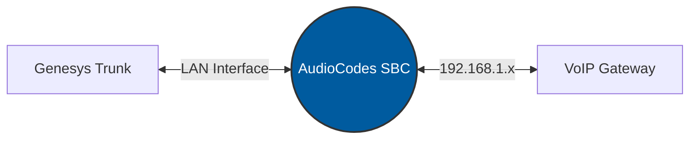

# 📘 AudioCodes Mediant 800 SBC - Sistem Yönetim Rehberi

Nolto B2B Projeleri ve Genesys Trunk entegrasyonları için hazırlanan, AudioCodes (Versiyon 7.20) temel yapılandırma ve işletim dokümantasyonuna hoş geldiniz.

---

## 📌 İçindekiler
1. [Hızlı Başlangıç ve Topoloji](#-hızlı-başlangıç-ve-topoloji)
2. [Ağ ve Medya Yapılandırması](#-ağ-ve-medya-yapılandırması)
3. [Güvenlik ve B2BUA Mimarisi](#-güvenlik-ve-b2bua-mimarisi)
4. [Sorun Giderme ve Loglama](#-sorun-giderme-ve-loglama)

---

## 🚀 Hızlı Başlangıç ve Topoloji

Bu rehber, **Genesys** altyapısı ile üçüncü parti **VoIP Gateway** cihazları arasında SIP ve RTP trafiğini şeffaf ve güvenli bir şekilde geçirmek üzerine kurgulanmıştır.

> [!IMPORTANT]
> **Versiyon Uyumu:** Bu belgedeki tüm menü yolları ve parametre isimleri **v7.20** Firmware yapısına tam sadıktır. Alt veya üst sürümlerde menü yerleşimleri farklılık gösterebilir.

### Temel Bağlantı Mimarisi (B2BUA)

---

## ⚙️ Yapılandırma Adımları Takip Listesi

Sıfırdan cihaz kurulumu yaparken aşağıdaki hiyerarşiyi takip etmek **Best Practice** standartlarındandır:

- [x] Fiziksel Ethernet bağlantılarının tamamlanması
- [ ] IP Interfaces ve VLAN ayarlarının yapılması
- [ ] Media Realm (RTP port aralıklarının) izole edilmesi
- [ ] SIP Interfaces (Sinyalleşme noktalarının) oluşturulması
- [ ] Proxy Sets (Hedef Sunucu IP'leri) tanımlanması
- [ ] **IP Profiles (Transparanlık ve SIP Headers ayarları)**
- [ ] IP Groups ile mantıksal eşleştirme yapılması
- [ ] SBC IP-to-IP Routing kurallarının yazılması

---

## 🛠 Sık Kullanılan Menü Referansları

| Yapılandırma Modülü | Menü Yolu (v7.20) | Kritik Parametreler |
| :--- | :--- | :--- |
| **Sinyalleşme Uçları** | `Setup > Signaling & Media > Core > SIP Interfaces` | Local Host Name, Application Type |
| **Profil & Başlıklar** | `Setup > Signaling & Media > Coders & Profiles > IP Profiles` | SBC Media Security Mode, Extension Coders |
| **Yönlendirme Kuralları**| `Setup > Signaling & Media > SBC > Routing > IP-to-IP Routing` | Source/Dest IP Group, Dest Type |

---

## 💡 İpuçları ve Best Practice'ler

> [!TIP]
> **Güvenlik Sıkılaştırması:** `Setup > Signaling & Media > SBC > SBC General Settings` altından **Unregistered Calls** ayarını `Restrict` yaparak, sadece Proxy Set'lerinizde IP'si olan sunuculardan gelen çağrıları kabul edebilir, internetten gelen rastgele taramaları engelleyebilirsiniz.

> [!WARNING]
> **From ve To Başlıkları Davranışı:** AudioCodes B2BUA yapısı gereği, gelen bir çağrıyı dışarı basarken **From** başlığına varsayılan olarak kendi çıkış SIP Arayüz IP'sini otomatik yazar. 7.20 sürümünde IP Profile menüsünde "Host Part in From Header" ayarı bulunmaz; bu nedenle SBC'nin varsayılan B2BUA davranışına güvenilmeli veya özel durumlarda *Message Manipulation* kullanılmalıdır.
