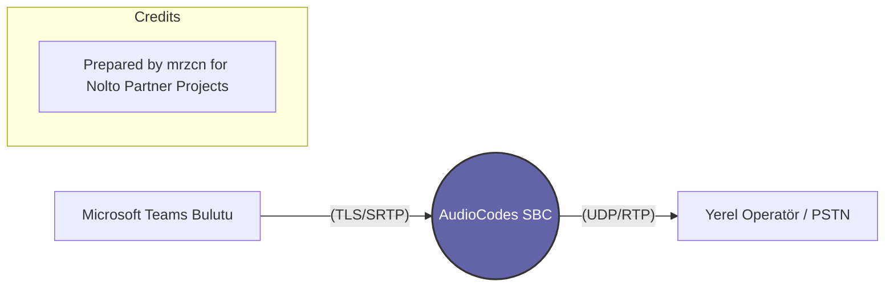

<!-- 
  _   _       _ _             _    ____  
 | \ | | ___ | | |_ ___      / \  / ___| 
 |  \| |/ _ \| | __/ _ \    / _ \ \___ \ 
 | |\  | (_) | | || (_) |  / ___ \ ___) |
 |_| \_|\___/|_|\__\___/  /_/   \_\____/ 
 AudioCodes Partner Training - mrzcn 2026
-->

# Teams Direct Routing Nedir?

Modern iş dünyasında iletişim Microsoft Teams üzerinden dönüyor. Ancak Teams'in dış dünyayı (GSM veya Sabit Hatlar) araması için bir "köprüye" ihtiyacı vardır. İşte bu köprüye **Teams Direct Routing** diyoruz ve bu köprünün tam ortasında **AudioCodes SBC** durur.

## 📌 Temel Kavram

Normalde Teams kullanırken dış hatları aramak için Microsoft'tan "Calling Plan" almanız gerekir (Pahalı ve her ülkede yok). **Direct Routing** ise şirketin mevcut operatörünü (Örn: Türk Telekom) Teams'e bağlamanıza izin verir.

## 📌 AudioCodes SBC Burada Ne Yapar? (Köprü Görevi)

1.  **Protokol Uyumu ve SILK Codec:** Teams, bulut üzerinden **TLS (Şifreli SIP)** ve **SRTP (Şifreli Ses)** mecburiyeti koşar. Operatörler ise genellikle UDP/TCP ve şifresiz RTP kullanır. AudioCodes bu iki farklı dünyayı birbirine bağlar. Ayrıca Teams, modern **SILK/Opus** codec kullanır. Eğer SBC'nizde DSP varsa SILK'i G.711'e çevirebilirsiniz.
2.  **Sertifika Yönetimi ve SNI:** Teams ile konuşmak için SBC üzerinde geçerli bir SSL sertifikası (Örn: DigiCert/GoDaddy) olması şarttır. Teams sunucuları bağlantıyı kurarken SBC'nin FQDN adresini kontrol etmek için TLS seviyesinde **SNI (Server Name Indication)** başlığını okur. SNI uyuşmazlığında bağlantı kurulmaz (`SIP OPTIONS` düşer).
3.  **Güvenlik:** Microsoft veri merkezlerinden gelen trafiği doğrular (FQDN tabanlı ACL kuralları) ve iç ağa süzerek aktarır.
4.  **Media Bypass (ICE/STUN):** Eğer ofisteki bir kullanıcı (Teams Client) ofisteki AudioCodes SBC üzerinden arama yapıyorsa, ses trafiğinin taa İrlanda'daki Microsoft bulutuna gidip gelmesine (Tromboning/Hairpinning) gerek yoktur. **ICE/STUN** protokolleri sayesinde Teams Client ile AudioCodes SBC aynı lokal ağda olduklarını keşfederler ve RTP (Medya) doğrudan lokal ağda akar. Bu, gecikmeyi ve bant genişliği israfını önler.

## 📌 Neden Önemlidir?

Bir yeni mezun için Teams Direct Routing öğrenmek, "Cloud Communications" (Bulut Haberleşme) dünyasına giriş anahtarıdır. AudioCodes, Microsoft tarafından bu iş için en çok tavsiye edilen (Certified for Microsoft Teams) markadır.

---

### Yapılandırma Akış Diyagramı

> [!IMPORTANT]
> Teams Direct Routing kurulumu yaparken SBC'nin FQDN adresinin (Örn: `sbc.nolto.com`) internete açık olması ve 5061 portunun Microsoft IP'lerine izin verecek şekilde ayarlanmış olması gerekir.

---

  <small>Ref: NLT-800-SBC-2026 | mrzcn © 2026</small>

m‌r‌z‌c‌n‌-‌n‌o‌l‌t‌o‌-‌a‌u‌d‌i‌o‌c‌o‌d‌e‌s‌-‌t‌r‌a‌i‌n‌i‌n‌g‌-‌2‌0‌2‌6‌

