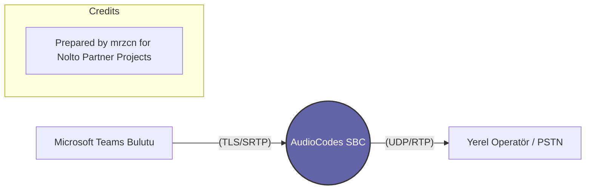

# Teams Direct Routing Nedir?

Modern iş dünyasında iletişim Microsoft Teams üzerinden dönüyor. Ancak Teams'in dış dünyayı (GSM veya Sabit Hatlar) araması için bir "köprüye" ihtiyacı vardır. İşte bu köprüye **Teams Direct Routing** diyoruz ve bu köprünün tam ortasında **AudioCodes SBC** durur.

## 📌 Temel Kavram

Normalde Teams kullanırken dış hatları aramak için Microsoft'tan "Calling Plan" almanız gerekir (Pahalı ve her ülkede yok). **Direct Routing** ise şirketin mevcut operatörünü (Örn: Türk Telekom) Teams'e bağlamanıza izin verir.

## 📌 AudioCodes SBC Burada Ne Yapar?

1.  **Protokol Uyumu:** Teams, bulut üzerinden sadece **TLS (Şifreli SIP)** ve **SRTP (Şifreli Ses)** kabul eder. Operatörler ise genellikle UDP/TCP ve şifresiz RTP kullanır. AudioCodes bu iki farklı dünyayı birbirine bağlar (Transcoding & Trans-shaping).
2.  **Sertifika Yönetimi:** Teams ile konuşmak için SBC üzerinde geçerli bir SSL sertifikası (Public CA) olması gerekir.
3.  **Güvenlik:** Teams sunucularından gelen trafiği doğrular ve iç ağa güvenli bir şekilde aktarır.
4.  **Media Bypass:** Eğer kullanıcı ve SBC aynı ağdaysa, ses trafiğinin buluta gidip gelmesine gerek kalmadan doğrudan (local) akmasını sağlar.

## 📌 Neden Önemlidir?

Bir yeni mezun için Teams Direct Routing öğrenmek, "Cloud Communications" (Bulut Haberleşme) dünyasına giriş anahtarıdır. AudioCodes, Microsoft tarafından bu iş için en çok tavsiye edilen (Certified for Microsoft Teams) markadır.

---

### Yapılandırma Akış Diyagramı

> [!IMPORTANT]
> Teams Direct Routing kurulumu yaparken SBC'nin FQDN adresinin (Örn: `sbc.nolto.com`) internete açık olması ve 5061 portunun Microsoft IP'lerine izin verecek şekilde ayarlanmış olması gerekir.

---
> [!CAUTION]
> **Yasal Uyarı:** Bu dökümantasyon içeriği dijital filigran ve izleme sistemleri ile korunmaktadır. İçeriğin izinsiz kopyalanması, çoğaltılması veya başka platformlarda paylaşılması durumunda yasal süreç işletilecektir.

Source: Adan-Zye-Audiocodes Repository
Owner: mrzcn
Partner: Nolto Teknoloji Anonim Şirketi (AudioCodes Turkey Partner)
Security ID: NLT-800-SBC-SEC-2026

