<!-- 
  _   _       _ _             _    ____  
 | \ | | ___ | | |_ ___      / \  / ___| 
 |  \| |/ _ \| | __/ _ \    / _ \ \___ \ 
 | |\  | (_) | | || (_) |  / ___ \ ___) |
 |_| \_|\___/|_|\__\___/  /_/   \_\____/ 
 AudioCodes Partner Training - mrzcn 2026
-->

# SIP ve RTP Protokolleri

SBC (Session Border Controller) yapılandırmasına geçmeden önce, yönettiği iki ana protokole (SIP ve RTP) kısaca değinmek sorun giderme (Troubleshooting) süreçlerinde hayati önem taşır.

## 📌 SIP (Session Initiation Protocol)

SIP, internet üzerinden ses, video ve anlık mesajlaşma oturumlarını **başlatmak, değiştirmek ve sonlandırmak** için kullanılan bir Sinyalleşme protokolüdür. 

* **Port ve Taşıyıcı:** Genellikle UDP veya TCP **5060** portunu kullanır. Şifrelenmiş SIP (SIPS veya TLS) kullanıldığında **5061** portu kullanılır.
* **Ne İş Yapar?** SIP, telefonun çalmasını, meşgule düşmesini, çağrının kabul edilmesini (Cevaplama) sağlar. Ancak SIP, sesin kendisini taşımaz! Sadece iki ucun birbiriyle tanışmasına aracılık eder.
* **Format:** HTTP protokolüne çok benzer (Request/Response mimarisi). Düz metin (Plain Text) tabanlıdır. `INVITE`, `ACK`, `BYE`, `200 OK` gibi metodlarla çalışır.

> [!TIP]  
> AudioCodes üzerinde Message Log aldığınızda gördüğünüz tüm metin blokları SIP protokolünün mesajlarıdır. Eğer telefon hiç çalmıyorsa veya 4xx/5xx hatası alıyorsanız sorun SIP katmanındadır.

## 📌 RTP (Real-Time Transport Protocol)

RTP, SIP aracılığıyla tanışan iki uç nokta arasında **gerçek ses (medya)** verilerini taşımak için kullanılan protokoldür.

* **Port ve Taşıyıcı:** Her zaman **UDP** protokolünü kullanır. Dinamik bir port aralığı kullanır (Örneğin, AudioCodes'da Media Realm bölümünde belirlenen 6000-6999 aralığı).
* **Ne İş Yapar?** Mikrofonunuzdan çıkan sesi paketlere böler, karşı tarafa iletir ve karşıdan gelen paketleri birleştirerek hoparlörünüze verir.
* **RTCP (RTP Control Protocol):** RTP'nin kalitesini (Jitter, Packet Loss, Delay) ölçen yardımcı bir protokoldür. 

> [!WARNING]  
> Telefonlar çalıyor, karşı taraf telefonu açıyor ancak ses gelmiyorsa (veya tek taraflı ses geliyorsa), sorun SIP ile değil, **RTP portlarının Firewall'da kapalı olması** veya NAT/SBC üzerindeki Media Realm / IP Routing ayarlarındaki bir sorundan kaynaklanmaktadır.

```mermaid
sequenceDiagram
    participant A as Arayan Telefon
    participant B as Aranan Telefon
    
    Note over A,B: 1. Sinyalleşme Fazı (SIP - TCP/UDP 5060)
    A->>B: SIP: INVITE (SDP: Benim RTP Portum 6000)
    B-->>A: SIP: 180 Ringing
    B-->>A: SIP: 200 OK (SDP: Benim RTP Portum 7000)
    A->>B: SIP: ACK
    
    Note over A,B: 2. Medya Fazı (RTP - UDP Dinamik Portlar)
    rect rgb(30, 40, 60)
    A->>B: RTP: Ses Verisi (Hedef Port 7000)
    B->>A: RTP: Ses Verisi (Hedef Port 6000)
    end
    
    Note over A,B: 3. Kapatma Fazı
    A->>B: SIP: BYE
    B-->>A: SIP: 200 OK
```

---

### SIP ve RTP'nin Birlikte Çalışma Mantığı (SDP Anatomisi)

SIP paketlerinin gövdesinde taşınan özel "zarf"a **SDP (Session Description Protocol)** denir. SIP paketleri iki kişinin telefonla birbirini aramasıysa, SDP o kişilerin "Hangi dilde konuşacağız ve nerede buluşacağız?" pazarlığıdır.

Bir SDP paketinin en kritik iki satırı şunlardır:
*   **`c=` (Connection Data):** Medya trafiğinin (RTP) gönderileceği hedef IP adresidir (Örn: `c=IN IP4 192.168.1.50`).
*   **`m=` (Media Announcement):** Hangi portun kullanılacağı ve hangi codec'lerin desteklendiğini belirtir (Örn: `m=audio 6000 RTP/AVP 8 18`). Burada 8 (PCMA/G.711) ve 18 (G.729) desteklenen dilleri temsil eder.

**SBC'nin Rolü (Media Anchoring):** AudioCodes cihazı B2BUA olarak çalıştığı için, içeri giren SIP paketini tutar, içindeki SDP `c=` satırındaki lokal IP'yi siler ve dış dünyaya **kendi dış IP'sini** yazar. Bu işleme Media Anchoring denir ve sesin her zaman SBC üzerinden geçmesini garanti eder.

### Early Media (Erken Medya) ve 183 Session Progress
Normalde ses trafiği (RTP), karşı taraf telefonu açtığında (200 OK mesajı sonrası) akar. Ancak operatör sistemlerinde "Aradığınız kişiye ulaşılamıyor" gibi anonslar telefon açılmadan **çalarken** duyulur. Buna **Early Media** denir ve SIP `183 Session Progress` mesajıyla tetiklenir. SBC konfigürasyonlarında en çok yaşanan sorunlardan biri "Anons duyulmaması" olup, genellikle IP Profile altındaki Early Media ayarlarının uyumsuzluğundan kaynaklanır.

---

  <small>Ref: NLT-800-SBC-2026 | mrzcn © 2026</small>

m‌r‌z‌c‌n‌-‌n‌o‌l‌t‌o‌-‌a‌u‌d‌i‌o‌c‌o‌d‌e‌s‌-‌t‌r‌a‌i‌n‌i‌n‌g‌-‌2‌0‌2‌6‌

