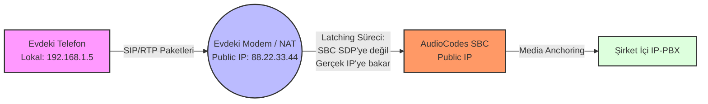

# NAT Traversal ve Media Anchoring

Network Address Translation (NAT), VoIP trafiğinin en büyük düşmanlarından biridir. SBC, "Tek taraflı ses" (One-way audio) sorunlarını çözmek için gelişmiş NAT yönetim araçları sunar.

## 📌 Media Anchoring (SBC Mode) Nedir?

Media Anchoring, SBC'nin ses paketlerini (RTP) her iki taraftan da üzerine alması ve tekrar iletmesi işlemidir. 
*   **Avantajı:** İki bacak arasındaki IP ve Port karmaşasını gizler.
*   **Güvenlik:** İç ağdaki cihazların IP adresleri asla dışarı sızmaz.
*   **Topoloji:** Cihazların birbirini doğrudan görmesine gerek kalmaz. Sadece SBC'yi görmeleri yeterlidir.

**Yapılandırma:** `Setup > Signaling & Media > Media > IP Profiles` -> `SBC Media Security Mode` ayarını inceleyin. Genellikle `SBC (Media Anchor)` seçilir.

### Bypass vs. Proxy Mode
*   **Proxy Mode (Anchoring):** Ses SBC'den geçer. NAT sorunlarını çözer, kaliteyi (MOS) ölçer.
*   **Bypass Mode:** Ses doğrudan uç cihazlar arasında (End-to-End) akar. Bant genişliği tasarrufu sağlar ancak NAT sorunlarına ve güvenlik zafiyetine yol açabilir. (Çok nadir kullanılır).

## 📌 Symmetric NAT ve SBC Davranışı

Symmetric NAT yapılarında, dışarıdan gelen ses paketleri sadece daha önce SBC'nin paket gönderdiği porttan içeri girebilir.
*   **Çözüm (NAT Keep-Alive):** SBC, karşı tarafın ses göndermesini beklemeden ona küçük bir paket (RTP No-Op veya boş RTP) göndererek Firewall üzerinde bir "delik" (pinhole) açar.
*   **First Packet Behavior:** `SBC First RTP Packet` ayarı. Genellikle SBC ilk paketi bekler ve paketin geldiği asıl IP/Port'a (SDP'de yazana değil) cevap verir. Buna **Latching** denir.

## 📌 Far-End NAT (Uzaktan Erişim ve STUN)

Evden çalışan bir personelin IP telefonu, evdeki modemin (NAT) arkasındadır. SIP mesajının içindeki SDP'de `192.168.1.5` yazacaktır.
*   **SBC Davranışı:** SBC, SDP'deki sahte IP adresine değil, paketin internetteki modemin **gerçekten geldiği** (Source IP/Port) adrese ses gönderir.
*   **STUN/ICE:** Gelişmiş NAT aşma protokolleridir. Cihaz kendi dış IP'sini bir sunucuya sorarak öğrenir. AudioCodes bu protokolleri desteklese de, çoğu senaryoda SBC'nin kendi `Remote NAT Traversal` algoritmaları yeterlidir.

## 📌 Media Optimization (Latching) Detayları

AudioCodes SBC, ses paketlerinin geldiği kaynağı dinamik olarak öğrenir ve ses akışını o adrese sabitler (Latching). 
*   Eğer bir IP değişimi olursa (Roaming), SBC yeni paketin geldiği portu hızlıca kavrar ve sesi oraya yönlendirir.
*   Eğer ses bir süre (Örn: 60 saniye) gelmezse, SBC güvenlik gereği portu kapatır.

> [!WARNING]
> **One-Way Audio Hata Avı:** Eğer "Ses sadece benden gidiyor ama karşıdan gelmiyor" diyorsanız, şu üç noktayı kontrol edin:
> 1. SBC'nin **Media Realm** yapılandırmasında yanlış bir IP Interface seçilmiş olabilir mi?
> 2. IP Profile içinde `SBC Media Anchor` açık mı?
> 3. Aradaki Firewall'da RTP port aralığı (Genellikle 6000-10000) UDP için izinli mi?

---

  <small>Ref: NLT-800-SBC-2026 | mrzcn © 2026</small>

m‌r‌z‌c‌n‌-‌n‌o‌l‌t‌o‌-‌a‌u‌d‌i‌o‌c‌o‌d‌e‌s‌-‌t‌r‌a‌i‌n‌i‌n‌g‌-‌2‌0‌2‌6‌

