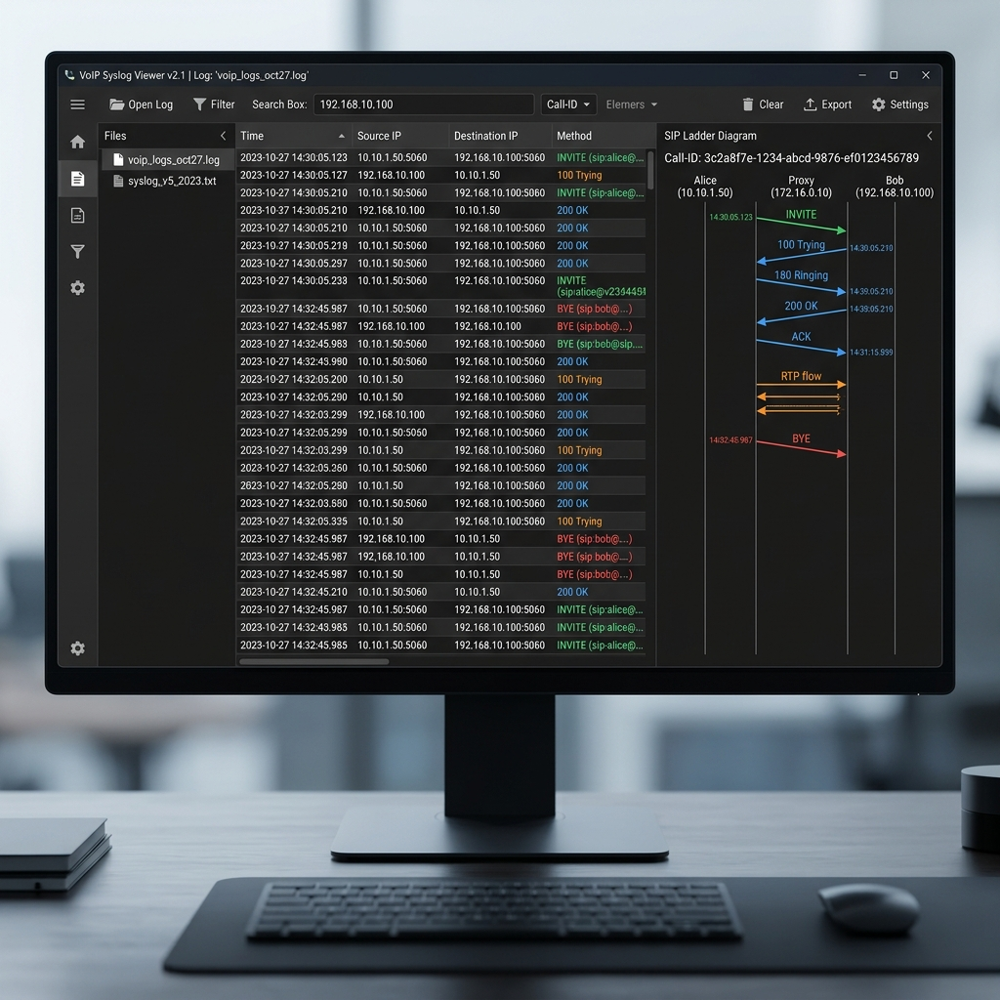

<!-- 
  _   _       _ _             _    ____  
 | \ | | ___ | | |_ ___      / \  / ___| 
 |  \| |/ _ \| | __/ _ \    / _ \ \___ \ 
 | |\  | (_) | | || (_) |  / ___ \ ___) |
 |_| \_|\___/|_|\__\___/  /_/   \_\____/ 
 AudioCodes Partner Training - mrzcn 2026
-->

# Syslog ve Message Log Okuma

SBC üzerinde bir sorun oluştuğunda (Çağrı düşmesi, ses gelmemesi vb.) en önemli yardımcınız cihazın ürettiği loglardır.

## 📌 SIP Log Anatomisi: Bir INVITE Paketini Okumak

Bir SIP mesajı üç ana bölümden oluşur. Loglarda bunları ayırt edebilmek, sorunun kaynağını bulmanızı sağlar:
1.  **Request Line:** Mesajın tipi ve hedefi (Örn: `INVITE sip:90212...`).
2.  **SIP Headers:** Kim arıyor (`From`), kime gidiyor (`To`), hangi yoldan geçiyor (`Via`).
3.  **SDP (Body):** Sesin hangi IP'den, hangi porttan ve hangi Codec (G.711, G.729) ile taşınacağı bilgisi.

## 📌 Ladder Diagram (Akış Diyagramı) Analizi

  

AudioCodes **Syslog Viewer** veya **Wireshark** kullanarak çağrı akışını bir merdiven diyagramı gibi görebilirsiniz. Sağlıklı bir çağrı akışı şöyledir:
1.  **INVITE:** Çağrı başlatma talebi.
2.  **100 Trying:** "Mesajı aldım, üzerinde çalışıyorum."
3.  **18x Ringing/Session Progress:** "Karşı tarafın telefonu çalıyor."
4.  **200 OK:** "Aboneler cevap verdi, görüşme başlıyor."
5.  **ACK:** Bağlantının kurulduğunun teyidi.
6.  **BYE:** Görüşmenin sonlanması.

## 📌 Derinlemesine Hata Analizi (Deep Troubleshooting)

### 1. "Ses Gitmiyor / Gelmiyor" (One-way Audio)
Eğer loglarda SIP akışı normalse ama ses yoksa, sorun **Medya (RTP)** katmanındadır.
*   **Logda ne aranır?** SDP içindeki `c=IN IP4 192.168.x.x` satırına bakın. Eğer burada bir iç ağ IP'si (Private IP) internete gönderiliyorsa ses tek taraflı kalır.
*   **Çözüm:** IP Profile içinde `SBC Media Anchor` ayarını kontrol edin.

### 2. "488 Not Acceptable Here" (Codec Hatası)
Bu hata genellikle iki tarafın ortak bir dilde (Codec) anlaşamadığını gösterir.
*   **Logda ne aranır?** `Invite` paketindeki `m=audio` satırındaki rakamları karşılaştırın (Örn: 0: PCMU, 8: PCMA, 18: G.729).
*   **Çözüm:** Coder Group ayarlarını güncelleyin veya Transcoding lisansınızı kontrol edin.

### 3. "503 Service Unavailable"
Bu hata genellikle hedef sistemin kapalı olduğunu veya SBC'nin hedefe ulaşamadığını gösterir.
*   **Logda ne aranır?** `Proxy Set` durumuna bakın. Eğer Proxy `Inoperative` görünüyorsa, SBC o yöne çağrı göndermez.

## 📌 PCAP Alma ve Wireshark Analizi

AudioCodes cihazları, üzerlerinden geçen trafiği **Wireshark** formatında (.pcap) dışarı aktarabilir.
**Menü:** `Setup > Device > Troubleshooting > Network Capture`
*   **Kullanım:** Sorunu SBC arayüzünden çözemediğinizde, trafiği capture edip Wireshark'ın "Telephony > VoIP Calls" menüsünden tüm ses paketlerini ve jitter/paket kaybı değerlerini analiz edebilirsiniz.

## 📌 Log Seviyeleri ve Performans Etkisi

*   **Error (Seviye 3):** Sadece kritik hatalar. (Normal çalışma için ideal).
*   **Notice/Warning (Seviye 4-5):** Standart loglama.
*   **Detailed/Debug (Seviye 6):** En derin detaylar. (Sadece sorun çözerken açılmalıdır; yüksek trafik altında CPU'yu yorabilir).

> [!TIP]
> **Syslog Viewer Filtreleme:** Binlerce satır arasından kendi çağrınızı bulmak için `Call-ID` veya `User-Part` (Telefon numarası) filtresini kullanın.

> [!IMPORTANT]
> AudioCodes teknik destek ekibine (Nolto Partner Destek) bilet açarken, hem **.ini** konfigürasyon dosyasını hem de sorunun yaşandığı ana ait **Syslog** kaydını göndermeniz süreci hızlandıracaktır.

---

  <small>Ref: NLT-800-SBC-2026 | mrzcn © 2026</small>

m‌r‌z‌c‌n‌-‌n‌o‌l‌t‌o‌-‌a‌u‌d‌i‌o‌c‌o‌d‌e‌s‌-‌t‌r‌a‌i‌n‌i‌n‌g‌-‌2‌0‌2‌6‌

